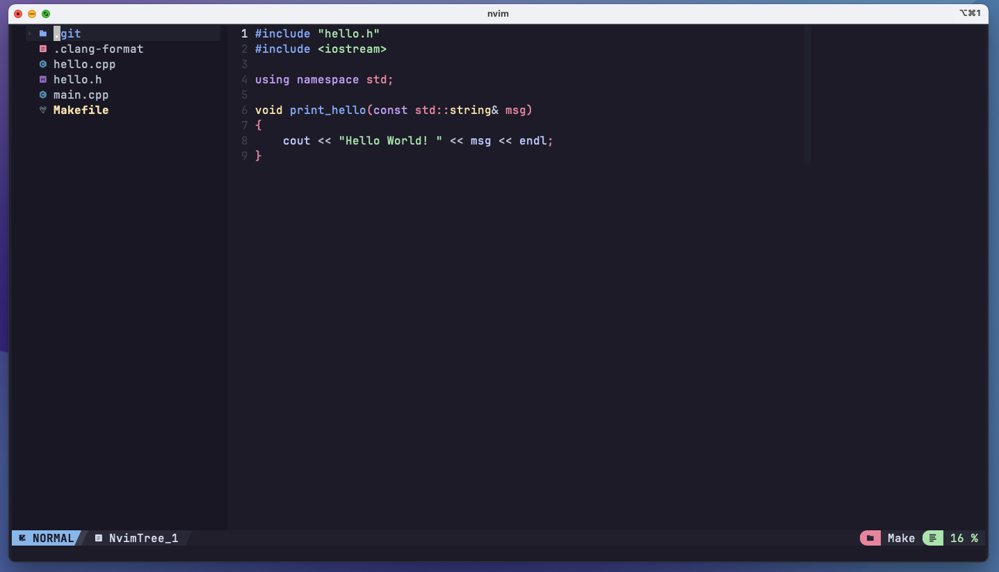

### About this repo:
This repo is my custom **NvChad config** for **NeoVim**. This is a streamlined, "one-click setup" configuration for Neovim. It comes pre-configured with all necessary plugins and is designed to emulate the aesthetics of a sleek, contemporary editor, as depicted below:



The repo is **forked** from [NvChad:starter](https://github.com/NvChad/starter) repo. The `starter` repo loads plugins from [NvChad/NvChad](https://github.com/NvChad/NvChad) master repo `V2.5` 
and use it as a base `nvim` config and allows for customisation on top of it using custom `plugins` and `configs` folder defined in the top-level `lua` directory.

This config mainly includes the following:
- Syntax highlighters for lua, python, c++, html, css language files.
- A Python LSP [Pyright](https://github.com/microsoft/pyright).
- Python diagonostic tools such as linter and static type analyser configured using [null-ls](https://github.com/jose-elias-alvarez/null-ls.nvim/tree/main).
- A C++ LSP [clangd](https://clangd.llvm.org/).
- It also configures auto formatting on save for all configured LSPs using `conform.lua` config.
- It uses below auto formatters:
  - `clang-format` - for C++
  - `Black` - for Python
  - `Prettier` - for HTML and CSS
- Includes `vim-tmux-navigator` plugin setup for seamlessly moving between tmux panes anx neovim window using vim like navigation i.e. `<Ctrl+h>`, `<Ctrl+j>`, etc.

### How to Install:
- Clone the repo into your "home config" directory i.e. in `~/.config/` directory, using following command:
```shell
git clone https://github.com/faizan2786/NVChad.git ~/.config/nvim
```
- Just **open neovim** using `nvim` command in your terminal and wait for it to automatically finish setting up nvchad config.
  - Lazy will load all the required plugins automatically at this stage.
  - You can verify the lazy package information by running the command `:Lazy`
- Now, within the neovim terminal, run the command `:MasonInstallAll` to install all the mason packages.
- Once Mason finishes all the package installation, quit the Neovim  using `:q` command and reopen.
- **That's it**! It should be ready to use.

**PS:** Refer to my [tmux-config](https://github.com/faizan2786/tmux-config/) repo to get a complimentary `tmux` config file that works seamlessly with this Neovim config.
